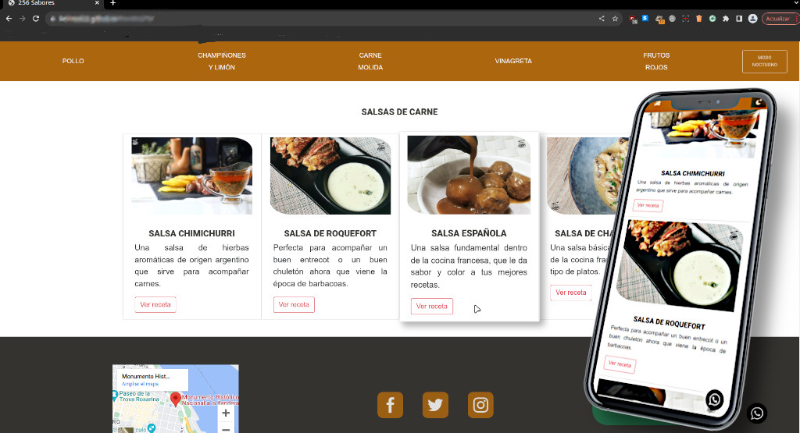

# FrontEndPD

*Proyecto para trayecto Frontend de Potrero Digital:
Creación de una una página web de recetas

### =============== 
###   Contenidos 
### =============== 

**index.html** --> coneitne una receta, y enlaces externos.  
**archivos organizados en carpetas** --> imagenes, fonts, css, js, icons y audio 

### =============== 
###   Tecnologías
### =============== 
**HTML5 | CSS3 | JS | Bootstrap**
